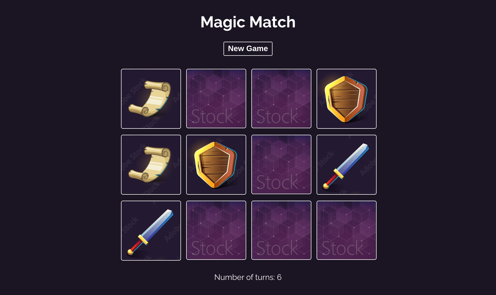

# Magic Memory

Also known as Matching Pairs, Match Match, Match Up, Memory, Pleonasm, Shank, Pexeso or simply Pairs, is a card game in which all of the cards are laid face down on a surface and two cards are flipped face up over each turn. The object of the game is to turn over pairs of matching cards.

## Run

This project was developed using React. to run it, clone this repo and run the following commands:

```
npm install
npm run start
```

## Build

To build the project, run

```
npm run build
```

## Preview


